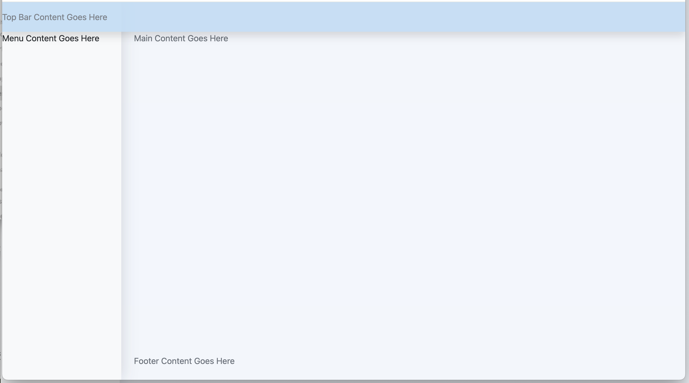
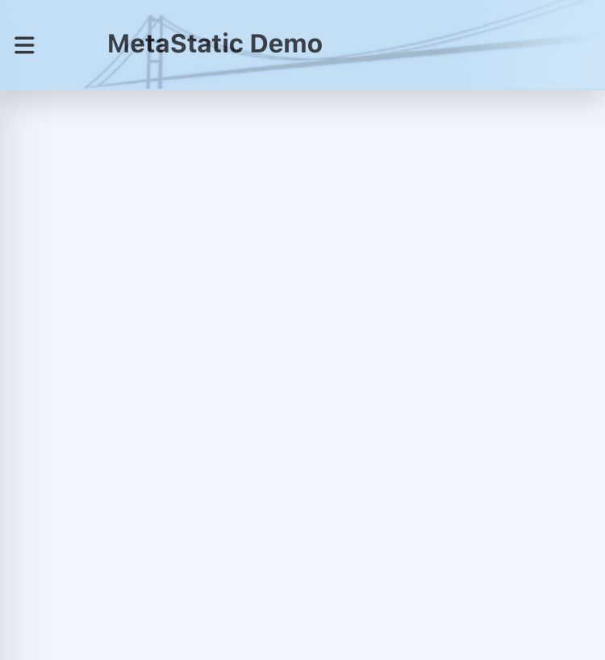

# MetaStatic Tutorial

### Building a Web Site Using the SB Admin Meta Tag Library

# Introduction

The MetatStatic Repository includes a Tag Library that provides a partial implementation of the Open Source [SB Admin](https://github.com/StartBootstrap/startbootstrap-sb-admin) User Interface.  What's included is sufficient to demonstrate:

- how a technical developer can build out such a Meta Tag Library
- how a Web Site maintainer can build and maintain a site using such a Tag Library

In this tutorial we'll explain in detail both aspects so that by the end of the tutorial you can begin to use MetaStatic for your own specific purposes.

# Getting Started

MetaStatic is written in JavaScript and therefore requires either Node.js or Bun.js to run.

In this tutorial I'm going to use Bun as it's a lot faster to run and much simpler to set up and maintain than Node.js, but if you're a Node.js developer it should be straightforward to translate the instructions to make them work with Node.js.

This tutorial also assumes that you'll be using a Linux machine.  Bun.js is also available for Windows and MacOS and once installed, all the commands should work identically apart from file path syntax differences.

So let's get started!

## Create a Work Directory

Create a directory for this tutorial and switch to it.

For example:

```code
mkdir mstutorial
cd mstutorial
```

## Install Bun.js

If you're using Linux or MacOS, the recommended way to install Bun.js is as follows:

```code
curl -fsSL https://bun.sh/install | bash
```

If you're using Windows, [refer to the Bun.js documentation](https://bun.sh/docs/installation).


## Clone the MetaStatic Repository

```code
git clone https://github.com/robtweed/metastatic
```

## Switch to the Repository's */examples* directory

cd cd metastatic/examples


## Start the Included Bun.js Web Server

We've included a basic but handy Web Server.  It's written in Bun.js and uses its extremely fast *Bun.serve* HTTP server.  This Web Server will allow you to quickly view the Web Site file(s) you generate in this tutorial directly from the location in which MetaStatic will create them.  

Note that this Web Server is **NOT** meant for production use!  

You'll see the Bun Web Server in the directory that you've previously switched to:

```code
bunws.js
```

and you can [view its source code here](./examples/bunws.js).

Note also that the file(s) generated by MetaStatic can be served up by any Web Server, so once you're happy with them, simply upload them to your Web Server.  You will, of course, need to ensure that any URL paths for images etc that you might use are correctly structured for your production Web Server.

To start the Web Server, just issue the following command from the */examples* directory:

```code
bun bunws.js
```

This will start the Web Server and it will listen on port 3000.  If you're already using that port for something else, Bun will report an error and fail to start.  If so, you can specify a different port, eg:

```code
bun bunws.js 8080
```

Note: the first time you invoke this command, Bun should automatically install all of the Web Server's dependencies.  If it doesn't, and if it reports an error, eg:

```code
error: Cannot find package "mg-bun-router" from "/home/ubuntu/metastatic-tutorial/bun/metastatic/examples/bunws.js"
```

Then try manually installing the missing package:

```code
bun install mg-bun-router
```

You should then be able to start the Web Server.


## Test the Web Server

The Bun Web Server is automatically configured to fetch static files from the */examples/sites* folders.  You can test it with the *demo* site which includes a pre-built *index.html* file.  In another process, type:

```code
curl http://localhost:3000/demo/index.html
```

or point a browser at this same URL.

if you followed the instructions correctly, you should see the file's contents or see them rendered in your browser.

If so, you're ready to begin exploring MetaStatic!

----

# The SB Admin Tag Library

## Background

You'll find the SB Admin Tag Library in your */examples/metaTagLibraries/sbadmin* directory.

You can also see the [source files here](./examples/metaTagLibraries/sbadmin).

The SB Admin User Interface (UI) is designed around a set of panels:

- a top bar, for titles etc
- a left-hand panel for menu options
- a footer panel for site information, copyright notices etc
- a main content panel

This UI is based on the popular Open Source responsive Bootstrap v5 CSS framework.  The built-in responsive behaviour is very nice: for example, you'll find that the menu panel will automatically collapse on small devices such as phones, and content will automatically stack vertically in small devices.

As such, the SB Admin UI is very powerful and versatile and can be used for many, if not most Web Sites to provide a modern UI for your content.

Of course, with MetaStatic you aren't limited to using this UI: any alternative UI can be implemented as a set of MetaStatic's Meta Tags and then used to construct your Web Site.  Their design is entirely up to you!

The *namespace* we've used for the SB Admin Tag Library is *sbadmin*, so you'll notice that all the individual Tag definition files are prefixed with this, eg:

- sbadmin-root
- sbadmin-header
- sbadmin-sidebar-menu

Each Meta Tag is defined in its own file which has a file extension of *.mst*, eg:

- sbadmin-root.mst
- sbadmin-header.mst
- sbadmin-sidebar-menu.mst

A Web Developer/Maintainer will use these as tags, eg:

- &lt;sbadmin-root>
- &lt;sbadmin-header>
- &lt;sbadmin-sidebar-menu>


## The Root Meta Tag

Every MetaStatic Tag Library will have a top-level tag within which all other Tags are nested.  What it's called is up to you.  In our case we've named this tag *sbadmin-root*.

You'll find it in your system at */examples/metaTagLibraries/sbadmin/sbadmin-root.mst*.

You can also inspect its [source code here](./examples/metaTagLibraries/sbadmin/sbadmin-root.mst).

We'll come back to explain its contents and how/why it works in detail later.

For now, suffice to say that this Meta Tag:

- creates the correct HTML &lt;head> tag contents for your Web Site:
  - loading the required Bootstrap-compatible CSS resources;
  - loading the Bootstrap JavaScript resources
  - loading the free Font Awesome icon resources
  - adding some specific customisable styles that override the standard *StartBootstrap* ones
- defines and creates the basic UI layout in the &lt;body> tag


## Creating Our Web Site

Let's get started and create a "bare bones" SB Admin Web Site.

Change to the */examples/sites/tutorial* directory that you'll find on your system.

In order to create a Web Site, you create a file with a file extension of *.meta*.  The file name is otherwise up to you, but by convention, a single page Web Site will normally have a name of *index*.

You'll find we've already created an instance of the *index.meta* file for you to get you started.  It's very simple and just contains the *sbadmin-root* tag and defines a value for its *title* attribute:

```html
<sbadmin-root title="MetaStatic Demo" />
```

Let's try building a Web Site from it.


## Running the MetaStatic Builder

You're best to run the MetaStatic Builder from within your */examples* directory:

- change to the correct directory, eg:

```code
cd ~/mstutorial/metastatic/examples
```

Then run the Builder:

```code
bun build.mjs tutorial
```

Specifying *tutorial* as a command line parameter will tell the builder to find your definition *.meta* file in your */sites/tutorial* directory.  By default it will look for and use a file named *index.meta*.  You could specify it explicitly by adding it as a second command line parameter:

```code
bun build.mjs tutorial index.meta
```

The first time you run this, Bun will automatically install all its dependencies.

You should then see the generated HTML returned in the terminal, but that same HTML should now be in a file named *index.html* in your */examples/sites/tutorial* directory.  

Try fetching it in a browser (making use of the Bun Web Server we started earlier):

```code
http://localhost:3000/tutorial/index.html
```

You should see an empty version of the SB Admin UI!


Clearly this isn't very useful as yet, but it's worth taking a look at what's been generated and why.

If you inspect the contents of the generated *index.html* file, you'll see that it includes everything that was needed to render this UI:

```html
<!DOCTYPE html>
<html>
  <head>
    <meta charset="utf-8">
    <meta http-equiv="X-UA-Compatible" content="IE=edge">
    <meta name="viewport" content="width=device-width, initial-scale=1, shrink-to-fit=no">
    <title>MetaStatic Demo</title>
    <link rel="stylesheet" href="https://startbootstrap.github.io/startbootstrap-sb-admin/css/styles.css">
    <script async="async" src="https://use.fontawesome.com/releases/v6.3.0/js/all.js" crossorigin="anonymous"></script>
    <script async="async" src="https://cdn.jsdelivr.net/npm/bootstrap@5.3.3/dist/js/bootstrap.bundle.min.js"></script>
    <style>
      .navbar-nav-scroll {
        max-height: var(--bs-scroll-height, 100vh);
        overflow-y: auto;
      }

      .bg-mgw {
        opacity: 0.9;
        background-color: #bdddf6;
      }

      .sidenav-light {
        background-color: #fff;
        color: #212832;
      }

      body {
        background-color: #f2f6fc;
        color: #69707a;
      }

      .bg-light {
        background-color: rgb(242, 246, 252) !important;
        color: #69707a;
      }

      .shadow-right {
        box-shadow: .15rem 0 1.75rem 0 rgba(33, 40, 50, 0.15) !important;
      }

      .sb-nav-fixed #layoutSidenav #layoutSidenav_nav {
        width: 225px;
      }

      .sb-nav-fixed #layoutSidenav #layoutSidenav_content {
        padding-left: 225px;
      }

      #layoutSidenav #layoutSidenav_nav {
        flex-basis: 225px;
        flex-shrink: 0;
        transition: transform 0.15s ease-in-out;
        z-index: 1038;
        transform: translateX(-225px);
      }

      #layoutSidenav #layoutSidenav_content {
        position: relative;
        display: flex;
        flex-direction: column;
        justify-content: space-between;
        min-width: 0;
        flex-grow: 1;
        min-height: calc(100vh - 56px);
        margin-left: -225pxpx;
      }

      @media (min-width: 992px) {
        #layoutSidenav #layoutSidenav_nav {
          transform: translateX(0);
        }

        #layoutSidenav #layoutSidenav_content {
          margin-left: 0;
          transition: margin 0.15s ease-in-out;
        }

        .sb-sidenav-toggled #layoutSidenav #layoutSidenav_nav {
          transform: translateX(-225px);
        }

        .sb-sidenav-toggled #layoutSidenav #layoutSidenav_content {
          margin-left: -225px;
        }

        .sb-sidenav-toggled #layoutSidenav #layoutSidenav_content:before {
          display: none;
        }
      }
    </style>
  </head>
  <body onload="init()" class="sb-nav-fixed">
    <nav class="sb-topnav navbar navbar-light navbar-expand shadow navbar-mgw bg-mgw">
    </nav>
    <div id="layoutSidenav">
      <div id="layoutSidenav_nav">
        <nav class="sb-sidenav shadow-right accordion sb-sidenav-light navbar-nav-scroll" id="sidenavAccordion">
        </nav>
      </div>
      <div id="layoutSidenav_content">
        <main>
          <div class="container-fluid px-4">
          </div>
        </main>
        <footer class="py-4 bg-light mt-auto">
          <div class="container-fluid px-4">
            <div class="d-flex align-items-center justify-content-between small">
            </div>
          </div>
        </footer>
      </div>
    </div>
    <script>
      function init() {}
    </script>
  </body>
</html>
```

Notice how the &lt;title> tag has used the title attribute value we specified in the &lt;sbadmin-root> tag:

```html
    <title>MetaStatic Demo</title>
```

It might not look like it yet, but this *sbadmin-root* tag has already generated all the basic scaffolding needed to create your own customised version of the SB Admin UI, with empty versions of:

- a top bar, for titles etc
- a left-hand panel for menu options
- a footer panel for site information, copyright notices etc
- a main content panel

So in a while we'll look at how you use and populate each of the four panel areas it's created for you.  But first, let's take a deep dive into that *sbadmin-root* Meta Tag definition, as it demonstrates almost all of the key features of MetaStatic.


## Key Features of the *sbadmin-root* Meta Tag

We're going to take an in-depth look at the *sbadmin-root* Meta Tag.  You'll find it in your system in the */examples/metaTagLibraries/sbadmin directory: it's the file named *sbadmin-root.mst*.

Alternatively view the [source code for it here](./examples/metaTagLibraries/sbadmin/sbadmin-root.mst).

The first thing to notice is that it contains two &lt;template> tags and a &lt;script> tag.

### First Template

Let's start with the very first line which is the first &lt;template> tag:

```html
<template 
 slot="*head"
 :title="^title|MetaStatic"
 :cssurl="^cssurl|https://startbootstrap.github.io/startbootstrap-sb-admin/css/styles.css"
 :faurl="^faurl|https://use.fontawesome.com/releases/v6.3.0/js/all.js"
 :bsurl="^brurl|https://cdn.jsdelivr.net/npm/bootstrap@5.3.3/dist/js/bootstrap.bundle.min.js"
 :topbarcolor="^topbarcolor|#bdddf6"
 :topbartextcolor="^topbartextcolor"
 :topbaropacity="^topbaropacity|0.9"
 :menubgcolor="^menubgcolor|#fff"
 :menutextcolor="^menutextcolor|#212832"
 :contentbgcolor="^contentbgcolor|#f2f6fc"
 :contenttextcolor="^contenttextcolor|#69707a"
 :footerbgcolor="^footerbgcolor|rgb(242, 246, 252)"
 :footertextcolor="^footertextcolor|#69707a"
 :topbargradient="^topbargradient"
 :menuwidth="^menuwidth|225px"
>
```

There's clearly a lot going on here!  But let's break it down and you'll find it's all actually remarkably simple.

Let's go through the attributes one by one:

#### slot

This attribute tells MetaStatic's Builder where to insert the markup that's within the &lt;template> tag.  The value in this case is *\*head*.  That asterisk (\*) prefix denotes that this refers to an actual HTML tag within the target page, in this case the initially empty &lt;head> tag.

It also highlights an important aspect of MetaStatic's Builder: its starting point is an empty HTML page:

```html
<html>
  <head></head>
  <body></body>
</html>
```

So the first or "root" Meta Tag that you specify in your *index.meta* Web Site description will be inserted by default into the &lt;body> tag, unless you tell it otherwise.  So in this case, the first &lt;template> tag is defining what we want to go into our &lt;head> section.

Note that MetaStatic will use the first instance of a tag that's referenced in a *slot* attribute (ie if the value is prefixed with an asterisk).  Of course, here there's only one &lt;head> tag, so that's OK!

#### :title

We've seen how this is used: it populates the &lt;title> tag within the &lt;head> section.  But how did that actually work?

You'll see that in the &lt;template> tag, the name of the attribute is prefixed by a colon character (:).  This tells MetaStatic's Builder to create a substitution variable named *:title*.

Note: substitution variable names **MUST** be all in lower case.


The value of this *:title* attribute is specified as *^title|MetaStatic*.  

That caret character (^) prefix tells MetaStatic's Builder to use the actual value in the &lt;sbadmin-root> tag that was used in the *index.meta* file: in this case *MetaStatic Demo*, ie as a result of this:

```html
<sbadmin-root title="MetaStatic Demo" />
```

The vertical bar character (|) followed by the text *MetaStatic* defines a default value that should be used if no *title* attribute was defined, eg if we'd used this in the *index.meta* file:

```html
<sbadmin-root />
```

If we take a look at the &lt;title> tag in the *template*, you'll see that the textContent of the &lt;title> tag should be substituted by whatever is the value of the *:title* variable:

```html
  <title>:title</title>
```

The variable *:title* could, in fact, be used as many times as needed within the *template*'s contents.  In the case of this *template*, however, we're only using it once - within the &lt;title> tag.

#### :cssurl

This allows you to optionally specify an alternative URL for the main CSS stylesheet.  If you look at its value in the template:

```code
:cssurl="^cssurl|hhttps://startbootstrap.github.io/startbootstrap-sb-admin/css/styles.css"
```

you'll see that once again it has two parts separated by a vertical bar character (|).  The first part tells tells MetaStatic's Builder to use the actual value in the &lt;sbadmin-root> tag that was used in the *index.meta* file - if it can find one.  We haven't specified a value however: all we specified was:

```html
<sbadmin-root title="MetaStatic Demo" />
```

So the second part after the vertical bar character defines a default value to use if the actual tag didn't define a value.  So in this case, the *:cssurl* value will be *https://startbootstrap.github.io/startbootstrap-sb-admin/css/styles.css*.

If we take a look further down inside the template markup we'll find this:

```html
  <link rel="stylesheet" href=":cssurl">
```

and in our generated *index.html* file this was substituted with that default value:

```html
    <link rel="stylesheet" href="https://startbootstrap.github.io/startbootstrap-sb-admin/css/styles.css">
```

The ability to define optional attributes with default values is a very powerful and useful feature, yet very simple to use, both by a developer of a Meta Tag and a user of that Meta Tag.

Why might you want to use it in this case?  One reason might be if you wanted to use a local copy of the CSS file rather than one fetched from a CDN.  Alternatively you may want to use your own customised version.

#### :faurl

This defines the URL to use for the Free Font Awesome icon library.  Just like the *:cssurl* attribute, it defines a default URL in the template (*https://use.fontawesome.com/releases/v6.3.0/js/all.js*) that you can optionally override.

It's used in this line within the template:

```html
  <script async src=":faurl" crossorigin="anonymous"></script>
```

#### :bsurl

This defines the URL to use for the Bootstrap v5 JavaScript library.  Just like the *:cssurl* attribute, it defines a default URL in the template (*https://cdn.jsdelivr.net/npm/bootstrap@5.3.3/dist/js/bootstrap.bundle.min.js*) that you can optionally override.

It's used in this line within the template:

```html
  <script async src=":bsurl"></script>
```

#### :topbarcolor

This allows you to optionally modify the background colour of the top bar.  A default value of *#bdddf6* is applied if no value is specified, and is used to substitute these lines within the custom &lt;style> tag within the head section:

```css
.bg-mgw {
  opacity: :topbaropacity;
  background-color: :topbarcolor;
  background-image: :topbargradient;
  color: :topbartextcolor;
}
```

#### :topbartextcolor

This allows you to optionally modify the colour of any text you define within the top bar.  No default is specified.  As a result, if you don't explicitly specify this attribute, the underlying default style provided by the SB Admin UI will be inherited instead: a light grey colour.


#### :topbaropacity

This allows you to optionally modify the opacity of the top bar.  A default value of *0.9* is applied if no value is specified, and is used to substitute these lines within the custom &lt;style> tag within the head section:

```css
.bg-mgw {
  opacity: :topbaropacity;
  background-color: :topbarcolor;
  background-image: :topbargradient;
  color: :topbartextcolor;
}
```

#### :topbargradient

This allows you to optionally specify a vertical colour gradient for the top bar.  By default, no gradient is defined, in which case the substituted value will be an empty string, ie:

```css
.bg-mgw {
  opacity: :topbaropacity;
  background-color: :topbarcolor;
  background-image: :topbargradient;
}
```

is substituted with:

```css
      .bg-mgw {
        opacity: 0.9;
        background-color: #bdddf6;
        background-image: ;
      }
```

so no gradient will be applied.

Here's an example of a gradient value:

```code
:topbargradient="linear-gradient(to top, #707595 0%, #0e1025 100%)"
```

Note that if you specify a *background-image* value, any *background-color* property is ignored: the *background-image* takes precedence.

#### Other Similar Attributes

All the other substitution variable attributes within the &lt;template> tag are hopefully now self explanatory: they all use the same kind of logic and syntax as described above:

- :menubgcolor="^menubgcolor|#fff" 
- :menutextcolor="^menutextcolor|#212832"
- :contentbgcolor="^contentbgcolor|#f2f6fc" 
- :contenttextcolor="^contenttextcolor|#69707a" 
- :footerbgcolor="^footerbgcolor|rgb(242, 246, 252)" 
- :footertextcolor="^footertextcolor|#69707a" 

These optional attributes are all used to substitute CSS property values within the &lt;style> tag at build time with either a value supplied by the Web Designer or a default value.

#### :menuwidth

This attribute defaults to a value of 225 and defines the width of the left-hand menu panel (measured in pixels).

If you require menu options with longer than normal text descriptions, you may need to increase this value.  Alternatively it may be worth lowering the value if you can to reduce the menu width.

----

### Second Template

The *sbadmin-root* Meta Tag's second template is much simpler and defines the specifically-styled markup that constitutes the basic SB Admin UI scaffolding.  This markup belongs within the generate Web Page's &lt;body> tag which, by default, is where MetaStatic's Builder will insert it.  Hence, the second Template starts with only a simple &lt;template> tag without specifying a *slot*:

```html
<template>
  <nav class="sb-topnav navbar navbar-light navbar-expand shadow navbar-mgw bg-mgw">

  ...etc

</template>
``` 

The key thing to notice within this Template are the four *slots*:

- topbar:

```html
  <nav class="sb-topnav navbar navbar-light navbar-expand shadow navbar-mgw bg-mgw">
    <slot name="topbar" />
  </nav>
```

- sidebar:

```html
      <nav class="sb-sidenav shadow-right accordion sb-sidenav-light navbar-nav-scroll" id="sidenavAccordion">
        <slot name="sidebar" />
      </nav>
```
- content:

```html
      <main>
        <div class="container-fluid px-4">
          <slot name="content" />
        </div>
      </main>
```

- footer:

```html
      <footer class="py-4 bg-light mt-auto">
        <div class="container-fluid px-4">
          <div class="d-flex align-items-center justify-content-between small">
            <slot name="footer" />
          </div>
        </div>
      </footer>
```

These provide the insertion points for any content/markup you want to add to these parts of the SB Admin UI.

Typically what you will use for such insertion is other *sbadmin* Meta Tags that are designed for use within each particular slot.  You'll see how to use them later on in this tutorial.

### Script Tag

Meta Tags can optionally contain one or two script tags.  There are two types you can specify:

- a standard HTML &lt;script> tag that defines JavaScript that is needed for event handlers etc within the Meta Tag's content.  

  The contents of such a &lt;script> tag is added to a &lt;script> tag that MetaStatic's Builder will have already added at the end of the &lt;body> section.

  MetaStatic's Builder keeps a note of all such inserted Meta Tag &lt;script> tags, and if any more instances of the Meta Tag are processed, their &lt;script> tags are ignored.  In other words, MetaStatic will ensure that there is only ever one instance of the JavaScript code for each Meta Tag you use in your Web Site.

- a &lt;script> tag with a *type* attribute whose value is *build*, which is what the *sbadmin-root* Meta Tag includes:

```html
<script type="build">
document.body.classList.add('sb-nav-fixed');
</script>
```

  Such scripts allow you to optionally define custom code that you want MetaStatic's Builder to execute at the end of its standard processing of the Meta Tag.  In this case we're adding a class to the generate'd Web Page's &lt;body> tag: something MetaStatic's Builder's own logic doesn't automatically make possible.

  You'll therefore see in the generated Web Page HTML:

```html
  <body onload="init()" class="sb-nav-fixed">
```

  If you want to provide your own custom *build* script in a Meta Tag, the main thing you need to know is that the generated Web Page DOM is held in the *document* object.  MetaStatic's Builder makes use of the
[jsdom](https://www.npmjs.com/package/jsdom) package which emulates the in-browser DOM APIs, so you can manipulate the generated Web Page's DOM using the standard DOM API methods and properties.

----

## Populating The SB Admin Slots

OK, let's get back to using the *sbadmin* Meta Tags.

Currently we've just created a Web Page that displays the SB Admin UI's basic appearance with its four panels, but without any content.

Let's do something very crude and simple and put some text into each one.  To do this, we'll just add four &lt;div> tags, one for each of the named slots provided by the *sbadmin-root* Meta Tag.

So, open up the *./sites/tutorial/index.meta* file in a text editor and change it to:

```html
<sbadmin-root title="MetaStatic Demo">
  <div slot="topbar">Top Bar Content Goes Here</div>
  <div slot="sidebar">Menu Content Goes Here</div>
  <div slot="content">Main Content Goes Here</div>
  <div slot="footer">Footer Content Goes Here</div>
</sbadmin-root>
```

Note how we've specified the slot to use for each &lt;div> tag by using a *slot* attribute.  The slot names must, of course, correspond to those used in the *sbadmin-root* Meta Tag.

Now simply re-run MetaStatic's Builder.  Remember to do this from within your *./examples* directory

```code
cd ~/mstutorial/metastatic/examples    # if necessary, then:
bun build.mjs tutorial
```

You'll find that the *index.html* file in the *./examples/sites/tutorial* directory has been over-written.

Try loading it into a browser (make sure you still have the Bun Web Server running!) using the same URL as before, eg:

```code
http://localhost:3000/tutorial/index.html
```

You should now see the text we specified occupying each of the respective SB Admin UI panels.


Next, while we're at it, let's try changing the top bar styling.  For example, re-edit the *index.meta* file as shown here:

```html
<sbadmin-root title="MetaStatic Demo" topbarcolor="blue" topbartextcolor="white">
  <div slot="topbar">Top Bar Content Goes Here</div>
  <div slot="sidebar">Menu Content Goes Here</div>
  <div slot="content">Main Content Goes Here</div>
  <div slot="footer">Footer Content Goes Here</div>
</sbadmin-root>
```

Re-run MetaStatic's Builder and refresh the newly built version of the *index.html* in your browser.  The top bar should now be blue and the text white.



You can try playing about with the other optional *sbadmin-root* attributes described in the previous section above to re-style the other panels.

----
## Creating a Header

Normally you'll want the header to include:

- some text as a title; and/or
- an image or logo

You'll also want a visual widget to control the menu, which, by convention, is depicted as three short horizontal stacked bars, often termed a "hamburger".

The *sbadmin* Meta Tag Library includes Meta Tags for these:

- *sbadmin-brand*
- *sbadmin-sidebar-toggle*

These could have been designed to be added inside the *&lt;sbadmin-root>* tag, but it wouldn't be entirely obvious that they would be populating the *sbadmin* top bar.

So, for clarity, the *sbadmin* Meta Tag Library includes another Meta Tag:

- *sbadmin-header*

This is very much a dummy, or "do-nothing" Meta Tag.  If you look at its 
[contents](./examples/metaTagLibraries/sbadmin/sbadmin-header.mst) you'll see that it simply contains:

```html
<template slot="topbar">
  <span />
</template>
```

Why bother, you might ask?  Hopefully this will become clear when you see how we can define how we want our top bar to appear.  Edit your *index.meta* tag as follows:

```html
<sbadmin-root title="MetaStatic Demo">
  <sbadmin-header>
    <sbadmin-sidebar-toggle />
    <sbadmin-brand text="MetaStatic Demo" src="images/logo.png" height="55" right="0" opacity="0.2" />
  </sbadmin-header>
</sbadmin-root>
```

You can hopefully see that use of the *&lt;sbadmin-header>* tag makes it clear that the top bar is defined by the two tags:

- &lt;sbadmin-sidebar-toggle>
- &lt;sbadmin-brand>

### *&lt;sbadmin-brand>*

The *sbadmin-brand* Meta Tag allows you to specify text and/or an image.  We're displaying both.  

The *height*, *right* and *opacity* attributes allow you to size, position and blend the image/logo within the top bar.

It's a good idea to use a color tool to determine your logo file's RGB value(s) and style the top bar's background colour or background gradient to match (see the *sbadmin-root* attributes described earlier).  As it happens, the *sbadmin* Meta Tags are pre-styled with colours that match the example image/logo that are included in this repository, so you'll see how such colour matching can work.

If you look at the source code for the 
[*sbadmin-brand* Meta Tag](./examples/metaTagLibraries/sbadmin/sbadmin-brand.mst), you'll notice that its *&lt;template>* tag doesn't specify a slot:

```html
<template>
 ... etc
</template>
```

You probably also noticed earlier that the *sbadmin-header* Meta Tag didn't specify a named slot in its *&lt;span>* tag.

This makes use of a shorthand convention in MetaStatic:

- if a Meta Tag doesn't include a *&lt;slot>* tag, its *firstChild* element is used as the insertion point for any child tags

Hence the *sbadmin-brand* *&lt;template>* tag doesn't need to explicitly define a slot for its insertion.


### *&lt;sbadmin-sidebar-toggle>*

You'll notice that the *sbadmin-sidebar-toggle* Meta Tag is specified without any attributes.  By default it will be coloured black.  Depending on the colour of your top bar, you may prefer to have it coloured white, in which case you simply add the attribute:

- color="light"

If you look at the source code for the 
[*sbadmin-sidebar-toggle* Meta Tag](./examples/metaTagLibraries/sbadmin/sbadmin-sidebar-toggle.mst), you'll notice that it contains a script tag:

```html
<script>
function toggle(e) {
  e.preventDefault();
  document.body.classList.toggle('sb-sidenav-toggled');
}
</script>
```

This will be added to the generated page's &lt;script> tag by MetaStatic's Builder.

You'll see in the Meta Tag's *template* how this is triggered:

```html
    <button class="btn btn-link btn-sm order-1 order-lg-0 me-4 me-lg-0" id="sidebarToggle" href="#!" onclick="toggle(event)">
```

You'll also notice that the *sbadmin-sidebar-toggle* Meta Tag doesn't specify a named slot in its *&lt;template>* tag, for the same reason described earlier for the *sbadmin-brand* Meta Tag.

### Rebuild the *index.html* File

Save your edited version of the *index.meta* tag and re-run the Builder:

```code
bun build.mjs tutorial
```

Refresh it in your browser and you should now see:


Try clicking the "hamburger" widget: the menu panel should slide in and out of view on each successive click.

Also try either reducing the width of the browser, or try viewing the page in your mobile phone's browser:



Notice how the menu panel has now automatically disappeared, but it will slide across into view when you click the "hamburger".

Notice also that the title text appears on top of the image.  That has been achieved by reducing the opacity of the image to 0.2: the image would otherwise obscure the text.


----
### To be continued...


